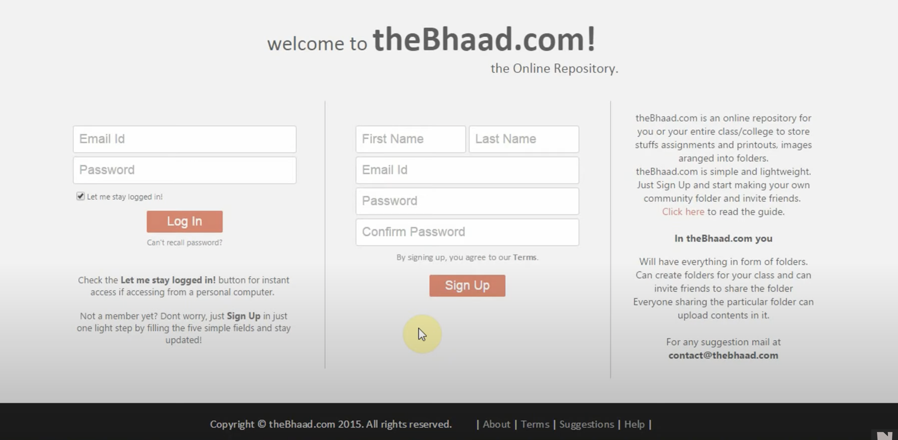
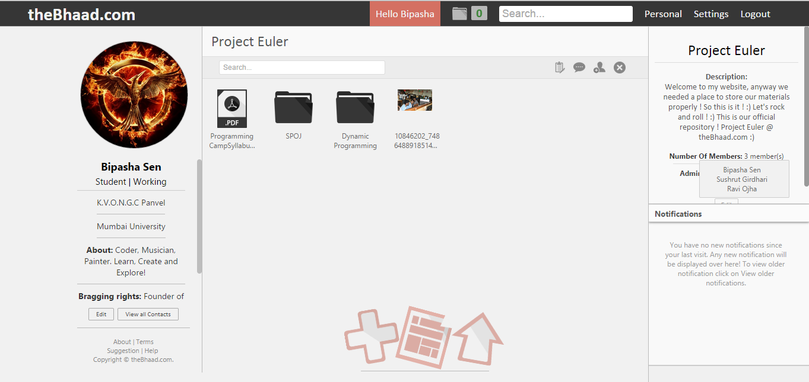
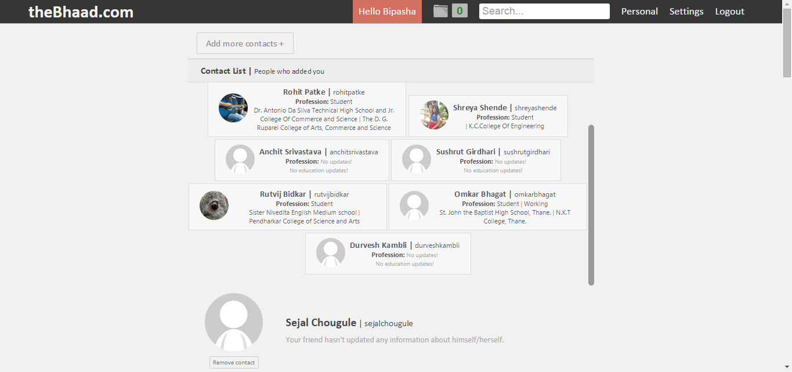
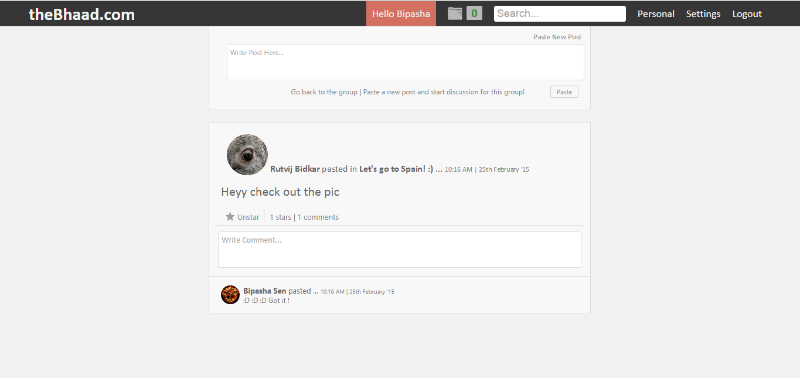
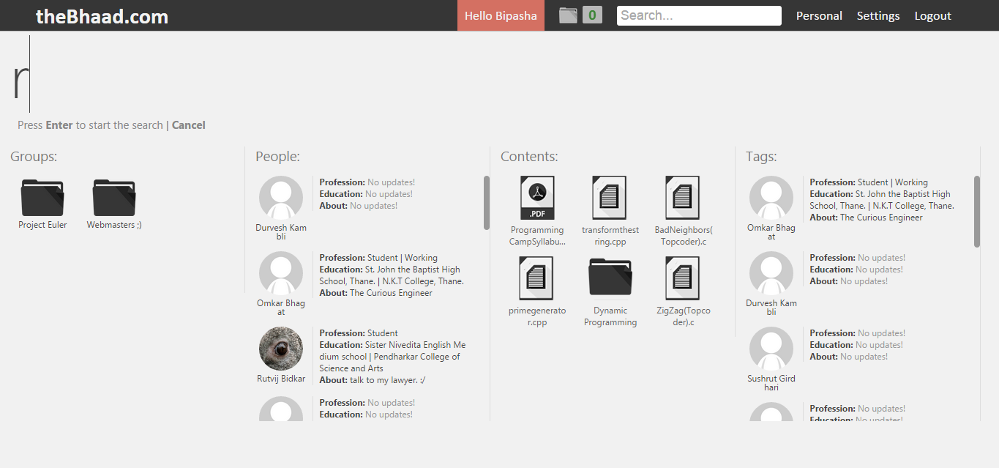

# theBhaad.com - an online repository

theBhaad.com is a cloud-based group orientated file-sharing platform that enables users to systematically share content with each other. 

Have a look at its feature and get a tour in this [**YouTube video - welcome to theBhaad.com**](https://www.youtube.com/watch?v=S9Oq2n2rIaY&t=178s)!



## Operating system like file-management interface. 



## Group management

Each group is made of ```n``` number of users. These users can communicate with each other in the group itself and share documents with the members of the group. Each group is like a folder that can entertain nested folders and files inside it. 

## Contacts 

Add contacts and manage contacts



## Forums 

Each group has a forum where group members can come and discuss.



## Search

Search for files/folders/people across groups.



## Additional Features

**Interface**: The interface is responsive to different platforms (mobile phones of different resolution, desktop etc.)

**Security**: It is immune to basic and advance attacks like SQL injection and data leakage. It stores all your data outside the root folder which makes is inaccessible to any random user on the web.

**Deployment**: thBhaad.com was deployed on DigitalOcean for a few years. Now it only exists in form of codebase. 
